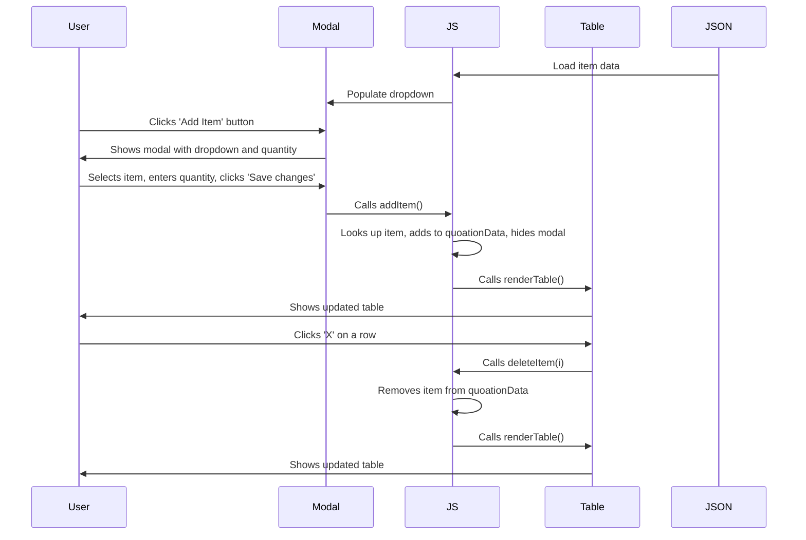

# Quotation System Documentation

## Overview

This quotation system allows users to create and manage quotations with items from a JSON data source. Users can add items via a modal, delete items from the table, and see real-time calculations for subtotal, VAT, and total due.

## **BEGINNER'S GUIDE: Understanding the Fetch Code**

If you're new to web development, here's a detailed breakdown of the code that loads data from the JSON file:

### The Selected Code:

```javascript
fetch("data/data.json")
  .then((response) => response.json())
  .then((data) => {
    itemList = data;
    // Populate datalist
    var options = data
      .map((item) => `<option value="${item.description}"></option>`)
      .join("");
    document.getElementById("data").innerHTML = options;
  });
```

### Line-by-Line Explanation:

#### Line 1: `fetch('data/data.json')`

- **What it does:** This is like asking your computer to go get a file from the internet or your local folder
- **Think of it like:** Sending someone to the library to get a book for you
- **`'data/data.json'`** is the "address" of the file (like a book's location in the library)
- **`fetch()`** is the "person" you're sending to get the file

#### Line 2: `.then(response => response.json())`

- **What it does:** Takes the "raw" file that was fetched and converts it into something JavaScript can understand
- **Think of it like:** The person brings back a book, but you need them to translate it from a foreign language first
- **`response`** is the raw file that was fetched
- **`response.json()`** converts the JSON text into JavaScript objects (like translating the book)

#### Line 3: `.then(data => {`

- **What it does:** Now that the data is translated, this line says "okay, now do something with this data"
- **Think of it like:** "Now that the book is translated, let's read it and do something with the information"
- **`data`** is the translated/parsed information from the JSON file

#### Line 4: `itemList = data;`

- **What it does:** Saves all the data from the JSON file into a variable called `itemList`
- **Think of it like:** Writing down all the important information from the book into your notebook
- **`itemList`** is your "notebook" where you store the information
- **`data`** is all the information from the JSON file

#### Line 5: `// Populate datalist`

- **What it does:** This is just a comment explaining what the next few lines will do
- **Think of it like:** A sticky note saying "I'm about to fill up the dropdown menu"

#### Line 6: `var options = data.map(item => `<option value="${item.description}"></option>`).join('');`

- **What it does:** Creates HTML options for the dropdown menu from the data
- **Think of it like:** Taking each item from your list and creating a menu option for it
- **Breaking it down:**
  - **`data.map()`** = "Go through each item in the data list"
  - **`item =>`** = "For each item, do this:"
  - **`` `<option value="${item.description}"></option>` ``** = "Create a dropdown option with the item's description"
  - **`.join('')`** = "Put all the options together into one big string"

#### Line 7: `document.getElementById('data').innerHTML = options;`

- **What it does:** Puts all the created options into the actual dropdown on the webpage
- **Think of it like:** Taking your menu options and putting them into the actual menu on the wall
- **`document.getElementById('data')`** = "Find the dropdown menu on the webpage"
- **`.innerHTML = options`** = "Put all the options we created into this dropdown"

### Visual Example:

**Before the code runs:**

```
Dropdown: [empty]
```

**After the code runs:**

```
Dropdown: [Stock Item Example 0001 ▼]
         [Stock Item Example 0002]
         [Service Charge Invoicing Item 001]
         [Service Charge Invoicing Item 002...]
```

### Why This Matters:

This code is essential because it:

1. **Loads your product data** from the JSON file
2. **Makes it available** for the rest of your application
3. **Creates the dropdown menu** so users can select items
4. **Happens automatically** when the page loads

### Common Mistakes for Beginners:

- **Wrong file path:** Make sure `data/data.json` exists and the path is correct
- **JSON syntax errors:** The JSON file must be properly formatted
- **Network issues:** The file must be accessible (not blocked by security)

---

## Features

### 1. **Modal System**

- **Trigger:** Click the "Add Item" button to open the modal
- **Purpose:** Allows users to select items and specify quantities
- **Components:**
  - Item dropdown (populated from `data/data.json`)
  - Quantity input field
  - Save changes and Close buttons

### 2. **Add Item Functionality**

- **Process:**
  1. User selects an item from the dropdown
  2. User enters quantity (defaults to 1)
  3. User clicks "Save changes"
  4. System validates the selection
  5. Item is added to the quotation table
  6. Modal closes automatically
  7. Table updates with new calculations

### 3. **Delete Item Functionality**

- **Process:**
  1. User clicks "X" button on any table row
  2. Item is removed from the quotation data
  3. Table updates with new calculations

### 4. **Real-time Calculations**

- **Subtotal:** Sum of all item amounts (quantity × unit price)
- **VAT:** 7% of subtotal
- **Total Due:** Subtotal + VAT

## Technical Implementation

### Data Flow



### Key Functions

#### `addItem()`

```javascript
function addItem() {
  // Get selected description
  var desc = $("#itemInput").val();
  // Find the item in itemList
  var item = itemList.find((i) => i.description === desc);
  if (!item) {
    alert("Please select a valid item.");
    return;
  }
  // Get quantity (default 1)
  var qty = parseFloat($("#newItemQty").val()) || 1;
  quoationData.push({
    description: item.description,
    quantity: qty,
    unitPrice: item.unitPrice,
  });
  $("#exampleModal").modal("hide");
  renderTable();
}
```

#### `deleteItem(i)`

```javascript
function deleteItem(i) {
  quoationData.splice(i, 1);
  renderTable();
}
```

#### `renderTable()`

```javascript
function renderTable() {
  var data = quoationData;
  var subTotal = 0;
  data.forEach((e) => {
    subTotal = subTotal + e.unitPrice * e.quantity;
  });
  var vat = (subTotal * 0.07).toFixed(2);
  var total = subTotal * 1.07;

  $("#subTotal").html("" + subTotal.toFixed(2));
  $("#vat").html("" + vat);
  $("#totalDue").html("" + total.toFixed(2));

  // Rebuild table rows
  var dataRows = data.map((e, i) => {
    let amount = e.quantity * e.unitPrice;
    return `<tr class="data-row">
                    <td class="text-center">${e.quantity}</td>
                    <td class="data">
                        <button onclick="deleteItem(${i})">X</button>
                        ${e.description}
                    </td>
                    <td class="text-right">${e.unitPrice.toFixed(2)}</td>
                    <td class="text-right">${amount.toFixed(2)}</td>
                </tr>`;
  });

  $(".data-row").remove();
  dataRows.forEach((r) => {
    $("#dataTable").append(r);
  });
}
```

## Data Structure

### `data.json` Format

```json
[
  {
    "quantity": 1.5,
    "description": "Stock Item Example 0001",
    "unitPrice": 900.0,
    "amount": 1450.0
  },
  {
    "quantity": 1,
    "description": "Stock Item Example 0002",
    "unitPrice": 450.0,
    "amount": 2000.0
  }
]
```

### `quoationData` Array Structure

```javascript
[
  {
    description: "Stock Item Example 0001",
    quantity: 2,
    unitPrice: 900.0,
  },
];
```

## File Structure

```
04-quotation/
├── index.html          # Main quotation page
├── data/
│   └── data.json      # Item data source
├── css/
│   └── styles.css     # Styling
└── README.md          # This documentation
```

## Dependencies

- **Bootstrap 4.0.0** - For modal and UI components
- **jQuery 3.6.0** - For DOM manipulation
- **Popper.js** - For Bootstrap tooltips and popovers

## Usage Instructions

1. **Open the quotation page** (`index.html`)
2. **Add items:**
   - Click "Add Item" button
   - Select an item from the dropdown
   - Enter quantity
   - Click "Save changes"
3. **Delete items:**
   - Click the "X" button next to any item in the table
4. **View calculations:**
   - Subtotal, VAT, and Total Due update automatically
5. **Print or save** the quotation as needed

## Customization

### Adding New Items

Edit `data/data.json` to add new items to the dropdown.

### Changing VAT Rate

Modify the VAT calculation in `renderTable()`:

```javascript
var vat = (subTotal * 0.07).toFixed(2); // Change 0.07 to desired rate
```

### Styling

Modify `css/styles.css` to customize the appearance of the quotation.

## Troubleshooting

### Common Issues

1. **Modal doesn't open:** Check Bootstrap and jQuery are loaded
2. **Items don't appear in dropdown:** Verify `data.json` is accessible
3. **Calculations are wrong:** Check for JavaScript errors in browser console
4. **Delete button doesn't work:** Ensure `renderTable()` is called after deletions

### Debug Tips

- Open browser developer tools (F12)
- Check Console tab for JavaScript errors
- Verify network requests to `data.json` in Network tab
- Use `console.log()` to debug data flow
